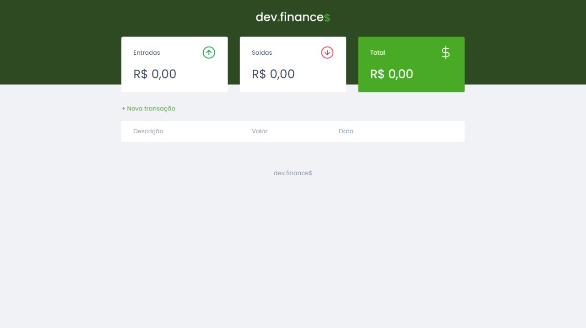

:rocket: Desafio #100DaysOfCode :rocket:
---
Repositório responsável por tratar do Desafio do #100DaysOfCode criado pelo [Alex Kallaway](https://twitter.com/ka11away)

## Primeiro projeto: 

### Desenvolvido na [Maratona de front-end](https://app.rocketseat.com.br/node/maratona-discover-edicao-01/lesson/aula-01) da RocketSeat
#### Você pode conferir o repositório [aqui](https://github.com/nycolexavier/Maratona-discover)

(developing repository)   
